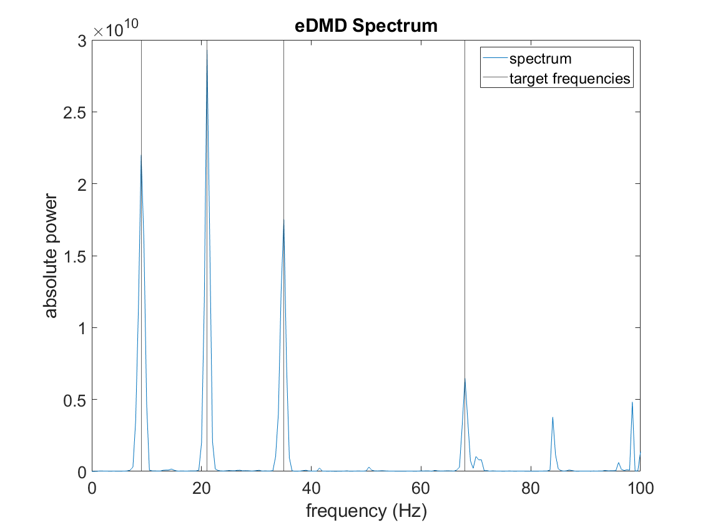
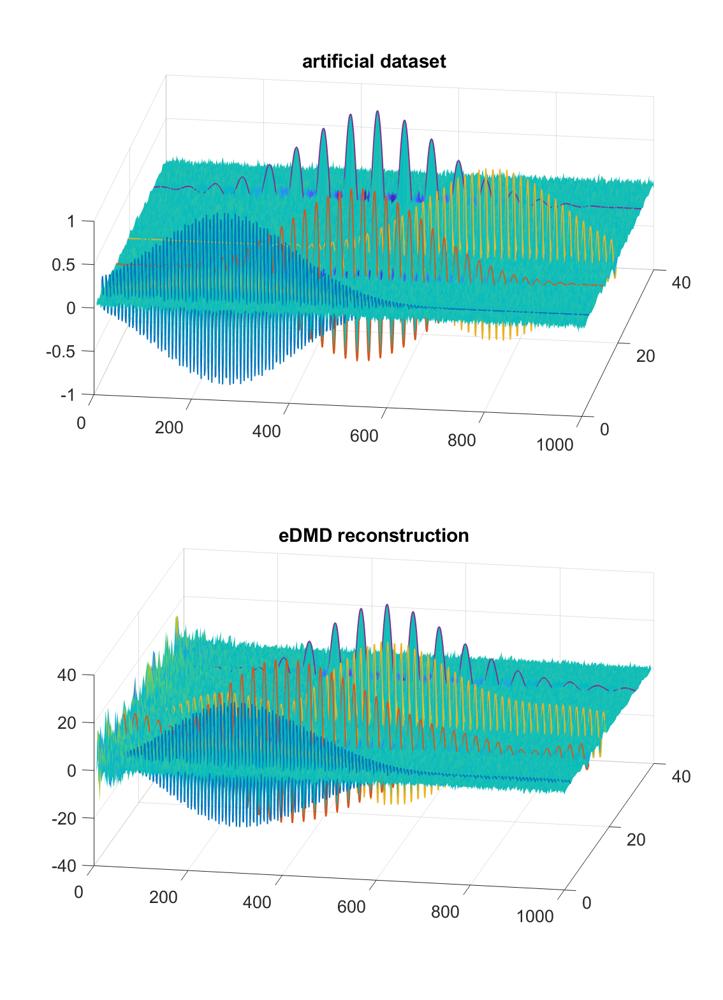
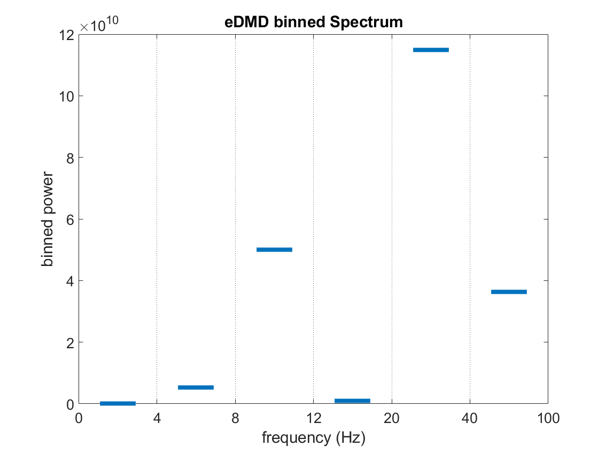

## Running ft_edmdanalysis on a data example

We can generate an artificial dataset to showcase the configuration and outputs of ft_edmdanalysis.  
```
%Generate an artificial dataset:
fs = 500;                            % Sampling Frequency
T  = 2;                              % Total time 
t  = 0:1/fs:T-1/fs;                  % Time vector     
rng(1)                               % Deterministic noise
nw = 0.03;                           % Noise amplitude
wp_w=0.2;                % Transient width parameter
wp_c = [0.51 1 1.5 0.9];  % Transient center vector
f0 = [68 21 35 9];        % Transient frequency vector
index_f = [4 12 19 33];   % Transient channel vector
nchan = 40; 

% Background noise matrix:
X = nw .* randn(nchan, length(t)); 

% Introduce transient oscillations:
  for i = 1:size(f0,2)    
      X(index_f(i) ,:) = exp(-((t-wp_c(i))./(2.*wp_w)).^2).*sin(2*pi*f0(i)*t);
  end
```

Generate FieldTrip metadata for our artificial dataset:
```
data = [];
data.label = arrayfun(@(x) sprintf('chan%d', x), 1:nchan, 'UniformOutput', false);
data.fsample = fs;
data.trial = {X};
data.time = {t};
data.sampleinfo = [1 numel(t)];
```

Implement the eDMD algorithm with a Random Fourier Features dictionary:

```
cfg = [];
cfg.output = 'freq';         % A frequency structure as output
cfg.dictionary = 'rff';      % Dictionary choice
cfg.gamma = 9.8;             % Gamma parameter, related to RFFs
cfg.D = 4000;                % RFFs cardinality
cfg.foi = 0:0.5:100;         % Frequencies of interest
cfg.verbose = false;
freq = ft_edmdanalysis(cfg, data);
```
Plot the spectrum, marking the expected dominant frequencies

```
figure;
plot(squeeze(freq.freq), squeeze(freq.powspctrm), 'DisplayName', 'spectrum')
hold on
h = xline(f0);
set(h(2:end), 'HandleVisibility', 'off')
set(h(1), 'DisplayName', 'target frequencies')
legend('show')
title('eDMD Spectrum');
xlabel('frequency (Hz)');
ylabel('absolute power');
```


Implement the eDMD algorithm with a reconstruction of the data as output. Note that besides cfg.output, all other options can stay the same:

```
cfg.output = 'raw';
raw = ft_edmdanalysis(cfg, data);
```

Plot the reconstruction next to the original data for comparison:
```
figure;
subplot(2,1,1)
surf(X, 'EdgeColor', 'none')
title('artificial dataset')
hold on
highlight_channels = [4 12 19 33];
colors = lines(numel(highlight_channels)); 
for i = 1:numel(highlight_channels)
    ch = highlight_channels(i);
    plot3(1:size(X, 2), ...
          repmat(ch, 1, size(X, 2)), ...
          X(ch, :), ...
          'Color', colors(i,:), 'LineWidth', 1.5)
end
subplot(2,1,2)
surf(raw.trial{1,1}, 'EdgeColor', 'none')
title('eDMD reconstruction', vector(jj))
hold on
highlight_channels = [4 12 19 33];
colors = lines(numel(highlight_channels));
for i = 1:numel(highlight_channels)
    ch = highlight_channels(i);
    plot3(1:size(raw.trial{1,1}, 2), ...
          repmat(ch, 1, size(raw.trial{1,1}, 2)), ...
          raw.trial{1,1}(ch, :), ...
          'Color', colors(i,:), 'LineWidth', 1.5)
end
```


Next, implement the eDMD algorithm with binned power as output. Custom frequency bins can be set, this is especially useful for analysis on specific bands (e.g., beta band activity in the dlPFC area shows correlation with the task...)

```
cfg.output = 'binned_peak_freq'; 
cfg.freqEdges = [0 4 8 12 20 40 100]; 
binned_peak = ft_edmdanalysis(cfg, data);
```

Plot binned power, marking the boundaries of the bins:

```
n = numel(binned_peak.freq);
x_centers = (1:n) + 0.5;
figure;
plot(x_centers, squeeze(binned_peak.powspctrm), '_', 'MarkerSize', 40)
hold on
edges = 1:(n+1);
h = xline(edges, 'k:');
set(h(2:end), 'HandleVisibility', 'off')
set(h(1))
xticks(edges)
xticklabels(round(cfg.freqEdges, 2))
xlabel('frequency (Hz)')
ylabel('binned power');
title('eDMD binned Spectrum');
```

